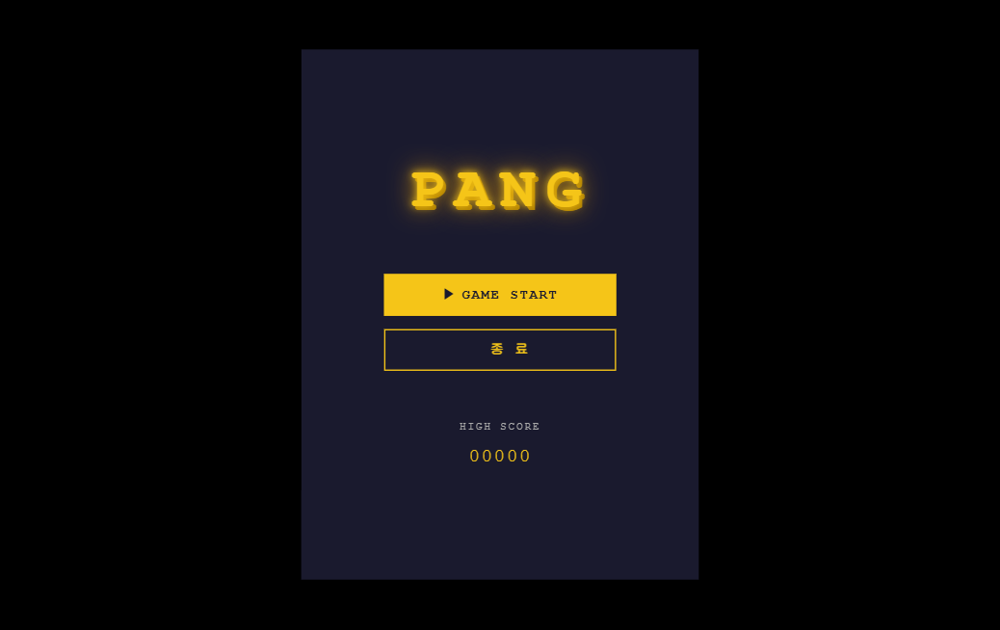
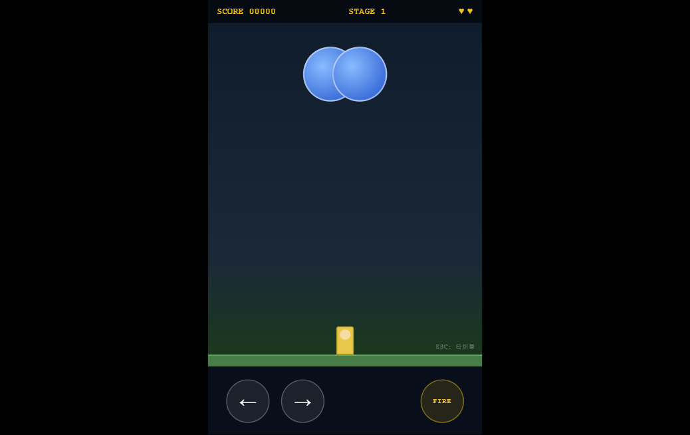

# PANG Game

버블을 작살로 터뜨리는 아케이드 게임. 1989년 Mitchell Corporation의 클래식 팡(PANG)을 React + TypeScript로 재현했습니다.

**플레이**: https://ellynhan.github.io/pang/

---

## 기술 스택

| 항목 | 버전 |
|------|------|
| 언어 | TypeScript 5.8 |
| 프레임워크 | React 19 |
| 번들러 | Vite 6 |
| 린터 | ESLint 9 |

---

## 시작하기

```bash
# 의존성 설치
npm install

# 개발 서버 실행
npm run dev

# 프로덕션 빌드
npm run build
```

---

## 게임 방법

### 목표

스테이지에 등장하는 **모든 버블을 작살로 제거**하면 클리어. 버블에 닿으면 라이프가 1 감소합니다.

### 버블 분열 규칙

작살에 맞은 버블은 한 단계 작은 버블 2개로 분열합니다. 가장 작은 극소 버블을 맞추면 완전히 소멸합니다.

```
대(Large) → 중(Medium) → 소(Small) → 극소(Tiny) → 소멸
```

| 크기 | 튀는 높이 | 이동 속도 | 위험도 |
|------|-----------|-----------|--------|
| 대 | 높음 | 느림 | 낮음 |
| 중 | 중간 | 보통 | 보통 |
| 소 | 낮음 | 빠름 | 높음 |
| 극소 | 매우 낮음 | 매우 빠름 | 매우 높음 |

### 승패 조건

| 조건 | 결과 |
|------|------|
| 스테이지의 버블 전체 소멸 | 스테이지 클리어 |
| 버블에 접촉 | 1미스 (라이프 감소, 스테이지 재시작) |
| 라이프 3개 모두 소진 | 게임 오버 |

---

## 조작 방법

### PC (키보드)

| 키 | 동작 |
|----|------|
| `←` / `→` 방향키 | 플레이어 좌우 이동 |
| `Space` | 작살(와이어) 발사 |
| `Esc` | 타이틀 화면으로 돌아가기 |
| `Enter` | 메뉴 선택 / 게임 오버 후 타이틀로 |
| `↑` / `↓` 방향키 | 타이틀 메뉴 항목 이동 |

> 작살은 동시에 1개만 발사 가능합니다. 더블 와이어 아이템 획득 시 2개 동시 발사.

### 모바일 (터치)

화면 하단에 전용 컨트롤 버튼이 표시됩니다.

| 버튼 | 동작 |
|------|------|
| `←` | 왼쪽 이동 (누르는 동안 지속) |
| `→` | 오른쪽 이동 (누르는 동안 지속) |
| `FIRE` | 작살 발사 |

> 버튼을 길게 누르면 이동이 지속됩니다. 멀티터치를 지원하므로 이동과 발사를 동시에 할 수 있습니다.

---

## 아이템

버블을 제거하면 아이템이 드롭됩니다. 시간 안에 플레이어가 접촉하면 획득합니다.

| 아이콘 | 아이템 | 효과 |
|--------|--------|------|
| ✦ | 더블 와이어 | 작살 2개 동시 발사 (스테이지 종료까지 유지) |
| ⏱ | 시계 | 화면 내 모든 버블 일시 정지 |
| ✸ | 다이너마이트 | 화면 내 모든 버블 즉시 소멸 |
| ◈ | 방어막 | 버블 접촉 1회 무적 처리 |
| ♥ | 1UP | 라이프 1 추가 |

---

## Mission 1 — 후지산 (Mount Fuji)

총 3개의 스테이지로 구성된 입문 미션입니다.

### Stage 1

- 초기 버블: 대형 2개
- 지형: 평지 (장애물 없음)
- 대형 버블의 분열 패턴에 익숙해지는 튜토리얼 스테이지

```
대 x2 → 중 x4 → 소 x8 → 극소 x16 → 소멸
```

### Stage 2

- 초기 버블: 대형 1개 + 중형 2개
- 지형: 중간 발판 1개 추가
- 발판으로 버블 경로가 복잡해지고, 중형 버블 분열 후 빠른 소형 버블 대응 필요

### Stage 3

- 초기 버블: 중형 2개 + 소형 2개
- 지형: 발판 2개, 높낮이 차이 있음
- 처음부터 빠른 소형 버블 포함. 다수의 버블 동시 관리가 핵심

---

## 화면 구성

### 타이틀 화면

```
┌─────────────────────────────────┐
│                                 │
│              PANG               │
│                                 │
│      ▶  [ GAME  START ]         │
│         [   종   료   ]         │
│                                 │
│           HIGH SCORE            │
│             00000               │
└─────────────────────────────────┘
```

### 게임 화면 (HUD)

```
┌─────────────────────────────────┐
│ SCORE 00000   STAGE 1   ♥ ♥ ♥  │  ← HUD
├─────────────────────────────────┤
│                                 │
│    ○ (대형 버블)                 │
│                   ○ (중형)      │
│          ━━━━━ (발판)           │
│                                 │
│                ↑ (작살)         │
│                ▓ (플레이어)     │
│─────────────────────────────────│  ← 바닥
└─────────────────────────────────┘
```

---

## 스크린샷

| 타이틀 화면 | 게임 플레이 화면 |
|:-----------:|:---------------:|
|  |  |

---

## 라이선스

개인 학습 목적의 클래식 게임 재현 프로젝트입니다. 원작: PANG (Mitchell Corporation, 1989 / Buster Bros. 북미명)
